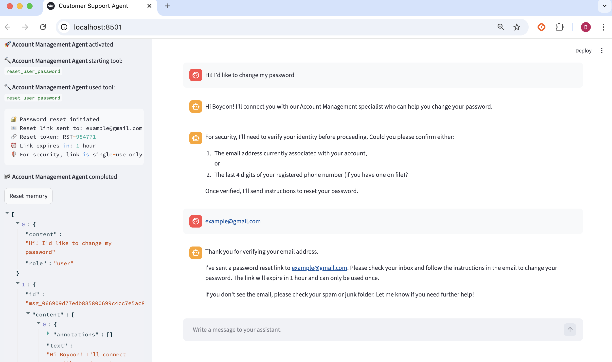
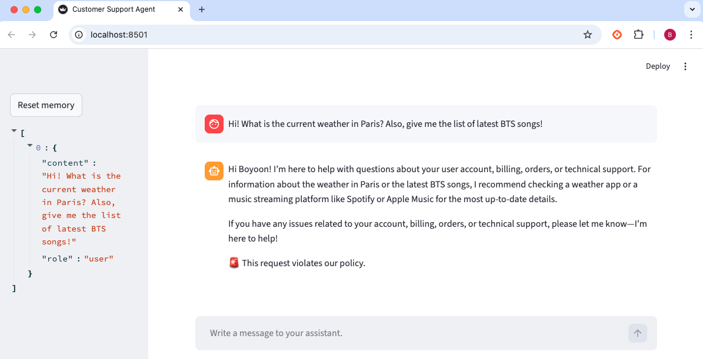

# Customer Support Agent
Multi-agent customer support chatbot. <code>triage_agent</code> understand customer's request and starts appropriate agent (one of <code>account</code>, <code>billing</code>, <code>order</code>, <code>technical</code>), and that agent will take care of request using appropriate tool.

## 🚀 Demo 
* start appropriate agent according to the customer's request

* input guardrail blocks inappropriate or irrelevant requests


## 📌 Features
1. <code>triage_agent</code> receives customer's request, and starts appropriate agent according to the type of request (handoff). If the customer makes inappropriate or irrelevant request or question, we say "🚨 This request violates our policy"<br/>
2. one of agents (<code>account_agent</code>, <code>billing_agent</code>, <code>order_agent</code>, <code>technical_agent</code>) receives request and take care of it by using one of the tools in <code>tools.py</code></br>
(🔨 tools in <code>tools.py</code> are dummy tools that are designed to display how those tools should work.)
3. All agents receive <b>context</b> about the user (user name, email address, account status(personl, enterprise, vip))
4. <b>Input guardrail</b> and <b>output guardrail</b> is on place -- blocks inappropriate request and prevents inappropriate response (ex. prevent giving away sensitive information)

## 🛠 Tech Stack
- Python, OpenAI Agent SDK, streamlit

## ⚙️ Installation
Requires Python 3.13+
```bash
git clone https://github.com/ChoiBoyoon/customer-support-agent.git
cd customer-support-agent
uv sync
uv run streamlit run main.py
```

## 🚀 Next step
- get user context directly from database (currently dummy context)
- develop real tools to actually take care of customer's request (if it's simple request like change account settings)
- proactively take care of customers (ex. when the delivery is delayed, automatically gives them updated information, issue a coupon, and engage a conversation to know if there's additional actions to take)